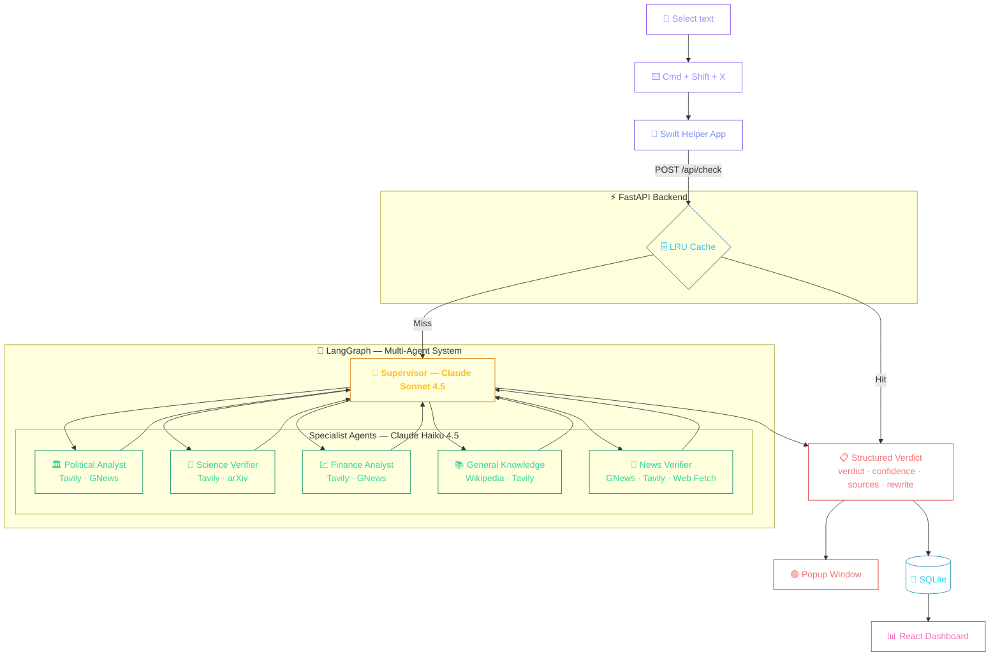

# 🦉 STRIX

> **Real-time AI fact-checking for your desktop.**
> Select any text, press a hotkey, get a source-backed verdict in seconds.

No browser extension. Works with any app on macOS.

---

## ✨ How It Works

```
 1. 📝  Select any text on screen
 2. ⌨️   Press  Cmd + Shift + X
 3. 🦉  STRIX popup appears with the verdict
 4. 📊  Check is saved to your local dashboard
```

---

## 🧠 Multi-Agent Architecture

STRIX uses a **LangGraph supervisor + specialist agents** system. Every claim is routed to the right domain expert, which searches the web in real time before Claude synthesises a verdict.



---

## 🤖 Specialist Agents

Each agent is a **ReAct loop** (Reason → Act → Observe) powered by Claude Haiku 4.5. The supervisor (Claude Sonnet 4.5) routes the claim, collects results, and writes the final structured verdict.

| Agent | Domain | Tools |
|-------|--------|-------|
| 🏛️ **Political Analyst** | Elections, policy, government, geopolitics | Tavily Search · GNews |
| 🔬 **Science Verifier** | Research, health, medicine, environment | Tavily Search · arXiv |
| 💹 **Finance Analyst** | Economics, markets, business, trade | Tavily Search · GNews |
| 📚 **General Knowledge** | History, geography, culture, biography | Wikipedia · Tavily Search |
| 📰 **News Verifier** | Breaking news, current events | GNews · Tavily Search · Web Fetch |

---

## 🛠️ Tech Stack

| Layer | Technology |
|-------|-----------|
| 🧠 LLM — Supervisor | Claude Sonnet 4.5 (Anthropic) |
| 🧠 LLM — Specialists | Claude Haiku 4.5 (Anthropic) |
| 🕸️ Agent orchestration | LangGraph + LangChain |
| ⚡ Backend | Python 3.10+ / FastAPI |
| 🗄️ Database | SQLite via aiosqlite (local, no setup) |
| 📊 Dashboard | React + Vite + Tailwind CSS + Recharts |
| 🖥️ Helper App | Swift (macOS native, menu bar) |

### Search APIs (all free tier)

| Tool | Provider | Free Tier |
|------|----------|-----------|
| 🔍 Web Search | [Tavily](https://tavily.com) | 1,000 req/month |
| 📰 News Search | [GNews](https://gnews.io) | 100 req/day |
| 📖 Encyclopedia | Wikipedia | Unlimited |
| 🔬 Science Papers | arXiv | Unlimited |
| 🌐 Web Fetch | Direct HTTP | Unlimited |

---

## 🚀 Installation

### Prerequisites

- **Python 3.10+**
- **Node.js 18+**
- **macOS** (for the helper app — backend + dashboard work on any OS)
- **Xcode Command Line Tools** (`xcode-select --install`)

### 1. Clone and configure

```bash
git clone https://github.com/YOUR_USERNAME/strix.git
cd strix
cp .env.example .env
# Edit .env with your API keys
```

### 2. Get API keys

| Key | Where to get it | Free tier |
|-----|----------------|-----------|
| `ANTHROPIC_API_KEY` | [console.anthropic.com](https://console.anthropic.com/) | Pay-as-you-go |
| `TAVILY_API_KEY` | [app.tavily.com](https://app.tavily.com/) | 1,000 req/month |
| `GNEWS_API_KEY` | [gnews.io](https://gnews.io/) | 100 req/day |

Wikipedia and arXiv require no API keys.

### 3. Start the backend

```bash
cd backend
python -m venv .venv
source .venv/bin/activate      # Windows: .venv\Scripts\activate
pip install -r requirements.txt
uvicorn main:app --reload
# → http://127.0.0.1:8000
```

### 4. Start the dashboard

```bash
cd dashboard
npm install
npm run dev
# → http://localhost:5173
```

### 5. Build and run the helper app (macOS)

```bash
cd strix-helper-swift
xcrun --sdk macosx swiftc main.swift -framework Cocoa -framework Carbon -o strix-helper
./strix-helper
```

The 🦉 STRIX icon appears in your menu bar. Select any text and press `Cmd+Shift+X`.

---

## 📋 Verdicts

| Verdict | Meaning |
|---------|---------|
| 🟢 **Supported** | Claim is factually correct — confirmed by evidence |
| 🔴 **Unsupported** | Claim is demonstrably false or contradicted by evidence |
| 🟡 **Misleading** | Contains truth but is deceptively framed or omits key context |
| 🟠 **Needs Context** | Partially true but requires important qualifications |

---

## 🔌 API Reference

### `POST /api/check`

```bash
curl -X POST http://127.0.0.1:8000/api/check \
  -H "Content-Type: application/json" \
  -d '{"text": "The Great Wall of China is visible from space"}'
```

**Response:**

```json
{
  "id": "uuid",
  "claim": "The Great Wall of China is visible from space",
  "verdict": "Misleading",
  "confidence": 82,
  "explanation": "While the Great Wall is very long, it is only ~6 metres wide...",
  "sources": [
    { "title": "...", "url": "...", "domain": "...", "relevance": "..." }
  ],
  "rewrite_suggestion": "The Great Wall of China is not visible to the naked eye from space",
  "checked_at": "2025-01-15T10:30:00Z",
  "search_time_ms": 3200,
  "analysis_time_ms": 7800
}
```

### `GET /api/checks`

List past checks. Query params: `verdict`, `min_confidence`, `max_confidence`, `limit`, `offset`.

### `GET /api/analytics`

Aggregated analytics: verdict distribution, daily counts, top claims, source domains.

---

## 📁 Project Structure

```
strix/
├── .env.example
├── README.md
├── LICENSE
├── backend/
│   ├── main.py                 # FastAPI app entry point
│   ├── config.py               # Environment settings
│   ├── database.py             # SQLite via aiosqlite
│   ├── schemas.py              # Pydantic request/response models
│   ├── requirements.txt
│   ├── agents/
│   │   ├── graph.py            # LangGraph supervisor + 5 specialist agents
│   │   └── tools.py            # LangChain tools (Tavily, GNews, Wikipedia, arXiv, Web Fetch)
│   ├── routers/
│   │   ├── check.py            # POST /api/check
│   │   └── dashboard.py        # GET /api/checks, /api/analytics
│   └── services/
│       └── cache.py            # In-memory LRU cache
├── dashboard/
│   ├── package.json
│   └── src/
│       ├── App.tsx             # Layout + navigation
│       ├── pages/
│       │   ├── Timeline.tsx    # Fact-check history
│       │   └── Analytics.tsx   # Charts + metrics
│       └── components/
│           ├── VerdictCard.tsx  # Expandable check card
│           ├── Charts.tsx      # Recharts visualisations
│           └── Filters.tsx     # Verdict + confidence filters
└── strix-helper-swift/
    └── main.swift              # macOS menu bar app (Swift)
```

---

## 🔒 Privacy

- All data stored **locally** in SQLite — nothing leaves your machine except API calls
- No telemetry, no accounts, no tracking
- API calls go to: Anthropic (LLM), Tavily (search), GNews (news), Wikipedia, arXiv
- You control all API keys via your local `.env` file

---

## 🤝 Contributing

1. Fork the repository
2. Create a feature branch: `git checkout -b feature/my-feature`
3. Commit your changes
4. Open a Pull Request

Keep code simple. Follow existing patterns. Test before submitting.

---

## 📄 License

MIT License. See [LICENSE](LICENSE) for details.
